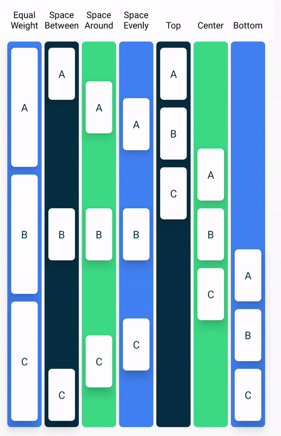

# Jetpack Compose

- Declarative. UI built in kotlin using lambda functions annotated by @Composable.
- Need to use state variables, when state changes, component is recomposed so reset to default value. Goal is to update state
- use remember so initial value not always loaded. remember remembers last value. mutableStateOf rerenders UI when value change. composable function called any time, so essential to have a remember
- Can write logic inside composable functions. Functions rendered in order written, effects applied accordingly
- function can be outside class
- the only way to update it is by calling the same composable with new arguments.
- Best practice to have modifier param in composable

Live Preview

```kotlin
@Preview(showBackground = true)
@Composable
fun GreetingPreview() {
  JetpackComposeTheme {
    Comp() // list fun that gen UI
  }
}
```

Basics

```kotlin
// state variable
val count = remember {
  mutableStateOf(0) // 0 is default value
}

val favourites = remember { 
  mutableStateListOf<Track>() // list is not initialised
}

var revenue by rememberSaveable { mutableStateOf(0) } // survives config changes

// text
Text(
  text = count.value.toString(), // value
  fontSize = 30.sp,
  color = Color.Blue,
  modifier = Modifier
    .background(Color.Red)
    .padding(16.dp)
    .background(Color.Green)
    .align(Alignment.CenterHorizontally),
  fontWeight = FontWeight.Bold,
  maxLines = 2, 
  overflow = TextOverflow.Ellipsis // Clip, Ellipsis, Visible
  style = TextStyle(textDecoration = TextDecoration.Underline)
)

Text(stringResource(R.string.bill_amount))

// button
Button(
  onClick = {
    count.value++
    if(name.isNotBlank()) {
      names = names + name
      name = ""
    }
  },
  colors = ButtonDefaults.buttonColors(containerColor = Color.Green, contentColor = Color.Black)
) {
  Text(text = "SSS") // text inside button
}

// edit text
OutlinedTextField( // TextField
  value = name,
  onValueChange = { text -> // text comes from edit text
    name = text
  },
  modifier = Modifier.weight(1f), // how muc space to occupy, like linear layout
  label = { Text(text="Lable") },
  singleLine = true, //  condenses textbox to a single, horizontally scrollable line from multiple lines
  keyboardOptions = KeyboardOptions(keyboardType = KeyboardType.Number),
  leadingIcon = { Icon(painter = painterResource(id = leadingIcon), null) },
  imeAction = ImeAction.Next // Search, Send, Go
)

// image
Image(
  painter = painterResource(id = R.drawable.ic_launcher_foreground),
  contentDescription = null,
  modifier = Modifier.background(Color.Blue).size(40.dp)
  alpha = 0.5F // image opacity
)

Icon(
  imageVector = Icons.Default.Add,
  contentDescription = "add",
  modifier = Modifier.size(54.dp)
)

// empty space
Spacer(modifier = Modifier.width(16.dp))

Box (contentAlignment = )  // box is simple container like Frame layout. Inner elements One on top of other

// column (elements vertically place)
Column(
  modifier = Modifier
    .fillMaxSize()
    .fillMaxWidth()
    .size(400.dp)
    .clickable { /* do click stuff. mouse scroll exception */ },
    .verticalScroll(rememberScrollState()) // add scroll bar
  verticalArrangement = Arrangement.SpaceBetween // Evenly,Around
  horizontalAlignment = Alignment.CenterHorizontally
) {
  // fun here. all elements to display in column
}

// recyclable
LazyRow{
  items(20) { // how many times to render items
    // fun here. all elements to display in column
    Icon(
      imageVector = Icons.Default.Add,
      contentDescription = "add",
      modifier = Modifier.size(54.dp)
    )

    Divider() // partition horizontal rule
  }
}

// iterate over items passed as list
// import androidx.compose.foundation.lazy.items
LazyColumn(modifier) {
  items(names) { currentName -> // names: List<String>
    Text(
      text = currentName,
      modifier = Modifier
        .fillMaxWidth()
        .padding(16.dp)
    )
    Divider()
  }

  // single item in end
  item { 
    // multiple items displayed only once
  }
}

// switch or checkbox
var roundUp by remember { mutableStateOf(false) }
Switch(
    checked = roundUp, // boolean
    onCheckedChange = onRoundUpChanged, // callback (bool) -> unit
)

// pass composable as function parameter
@Composable
fun CompFun(
 anotherComposableFunction: @Composable () -> Unit
) {
  anotherComposableFunction()
}
```

MainActivity

```kotlin
setContent {
  JetpackComposeTheme {
    Surface(modifier = Modifier.fillMaxSize(), color = MaterialTheme.colorScheme.background) {
      Column {
        Greeting("Android")
        IMG("msg")
        RV()
        State()
      }
    }
  }
}
```

# Elements

## Colours

```kotlin
import androidx.compose.ui.graphics.Color
```

## Surface

Basic building block

```kotlin
Surface(color = Color.Cyan) {}
```

## Modifier
Used to decorate composable
</img>

# Navigation

Dependency
`implementation("androidx.navigation:navigation-compose:2.7.6")`
```kotlin
@Composable
fun CuteDogPicturesApp() {
  val navController = rememberNavController()
  NavHost(navController, startDestination = "feed", modifier = Modifier) {
    composable(route = "feed") {
      FeedScreen(navController)
    }
    composable(route = "adopt") {
      AdoptionScreen()
    }
  }
}

@Composable
fun FeedScreen(navController: NavController) {
  Button(onClick = { navController.navigate("adopt") }) {
    Text("Click me to adopt!")
  }
}

@Composable
fun AdoptionScreen(...) { ... }

// ideal approach is to create enum or sealed class

// paramters
sealed class Screen(val route: String) {
  object Feed: Screen("feed")
  object Adopt: Screen("dog/{dogId}/adopt")
}

@Composable
fun AdoptionScreen(navController: NavController, dogId: String) { ... }
```

# Confirm / Alert Dialog
```kotlin
AlertDialog(
  onDismissRequest = { openDialog.value = false },
  title = { Text(text = "Dialog Title Will Show Here") },
  text = { Text("Here is a description text of the dialog") },
  confirmButton = { 
    Button( 
      onClick = { openDialog.value = false }
    ) { Text("Confirm Button") }
  },
  dismissButton = {
    Button(
      onClick = { openDialog.value = false }
    ) { Text("Dismiss Button") }
  }
)
```