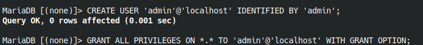

# General Commands

## Basic
```sh
touch thank.txt you.html for.c this.java # each word is separate file
touch file-{1..10} # creates file file-1, file-2 … file-10
touch -d tomorrow # (date) file created in future
shred file.txt # garbagify
rmdir # delete folder

useradd user
su user # switch user # exit?
sudo passwd user # set password

man # full description
whatis # small description

which finger # path to executable
whereis finder # all executables

wget https:// # downloads

less file.txt # displays file in pages unlike cat
find <path> -name “filenamt.txt”

w # logged in users
```

## Services / systemctl / systemd
- daemons - process that we dont start. process name ending with d with daemon
- systemd - starts, stops, manages daemons | service manager | init system, after kernel boots | pid - 1
- pstree # services as tree
- units - daemons
```sh
ps -aux list processes

systemctl stop <process> # start, stop, status, restart, reload 
# disable / enable  - toggle auto run at startup
list-units # list all
list-units -t <type> # type=service

list-units # shows only those that attempted to load to mem
list-unit-files # all files

journalctl -xe # logs for systemctl
```
## Path
shortcut to folder. whenever we run a command, the shell checks all path folders for that command

add (bin directory) to path // we concatenate bcs not want to lose previous dir // separated by :

temporary  `PATH=$PATH:~/bin`

archlinux-java built in util

### Android
Inside android sdk folder, emulator dir

`emulator -list-avds`

Run one of the listed emulators with -avd flag:
`emulator -avd name-of-your-emulator`

`export ANDROID_HOME=/home/manan/software/android-sdk`
`export PATH="$PATH:$ANDROID_HOME/platform-tools"`

May add to .bashrc

## Android
### APK from AAB
```
brew install bundletool # package manager
bundletool build-apks --mode universal --bundle ./app-release.aab --output ./app.apks
mv app.apks app.zip
unzip app.zip

``` 


## Command Alias
`alias cs="helix -w /home/manan/code/Code-Snippets/"`
May add to .bashrc

# System Configure

## Terminal

`.bashrc` in home is terminal load up file adding command to EOF runs that command.

add `fish` for fish terminal

## Sym Link

After running this command, you will be able to access the '/home/james/transactions.txt' with 'trans.txt'. Any modification to trans.txt will also be reflected in the original file.

always give full path

```sh
ln -s from to

ln -s /archive/google-drive/distractions.txt /home/manan/d.txt
```

## Firewall

```sh
systemctl status firewalld
systemctl stop/start firewalld

firewall-cmd --list-ports

firewall-cmd --add-port 3000/tcp # not persistent. returns to default when device reset
firewall-cmd --permanent --add-port 3000/tcp # didn't work
```

## Port

```sh
sudo fuser -k 81/udp kill port
```
## Drive Mount
Create directory /diska
`sudo mount from to`
`sudo mount /dev/sda1 /diska`

fstab (automount drive)
```
original-path-or-uuid    new-path-mount-point     type
/dev/sda1                /data                    ntfs     defaults    0 0
```

## File Structure
- bin - binaries, sbin - system admin binaries (admin single user mode)
- boot - bootloader
- dev - devices - hardware hdd, keyboard
- etc - etcetera - config system wide
- lib - libraries used by binaries
- media, mnt - mounted driver
- opt - optional manually installed software
- proc - info about system process
- root - root folder, like home
- run - tempfs stored in ram // create when sys boot
- srv - service, ftp server,, web server
- sys - interact with kernel // create when sys boot
- tmp - temporary
- usr - user apps
- var - variable // files folders expected to grow in size

# Installing DB Databases 
## Install PostgreSQL EOS
```sh
sudo pacman -S postgresql
sudo systemctl status postgresql # should not be running
sudo su - postgres # always this when admin work on psql
initdb --locale en_US.UTF-8 -D /var/lib/postgres/data # init data directory

exit # logout user
sudo systemctl start postgresql # start psql

sudo su - postgres # login

psql # enter psql shell

CREATE USER jonathan;
CREATE USER davide WITH ENCRYPTED PASSWORD 'jw8s0F4';

GRANT ALL PRIVILEGES ON DATABASE database_name TO username;

# createuser --interactive # psql username can be same as system. allows access to database without specify user
```


## MongoDB

```sh
yay -S mongodb-bin mongodb-tools-bin
sudo systemctl enable mongodb
sudo systemctl start mongodb
yay -S mongodb-bin mongodb-tools-bin

# bin name is mongosh
```

## Mysql

```sh
sudo pacman -S mysql
sudo mysql_install_db --user=mysql --basedir=/usr --datadir=/var/lib/mysql

sudo -i

mysql -u root -p
CREATE USER 'admin'@’localhost’ IDENTIFIED BY 'admin';
GRANT ALL PRIVILEGES ON *.* TO 'admin'@'localhost' WITH GRANT OPTION;

FLUSH PRIVILEGES;
```
# Misc
## Android Studio Move avd dir

```sh
mv /home/.android/avd /data/software/android-avd

ln -s /data/software/android-avd/avd /home/manand/.android/avd
```

## XAMPP Directory

`yay -S libxcrypt-compat` for xampp err

- Stop xampp: `sudo /opt/lampp/lampp stop`

- Open `/opt/lampp/etc/httpd.conf`

- Change your_folder:

```sh
DocumentRoot "/home/username/your_folder"
<Directory "/home/username/your_folder">
```

- Change **User & Group** value from daemon to:

```
User nobody
Group nogroup
```

in eos had to set group to nobody after checking in /etc/group

set chmod to your_folder with this command

- sudo chmod 777 /home/your_folder

Save the file and start xampp with this command:

sudo /opt/lampp/lampp start

## GRUB Menu

/etc/default/grub

```
GRUB_TIMEOUT = '0'
```

update-grub command, shell script in /usr/sbin/:
**sudo nano /usr/sbin/update-grub**

```
#!/bin/sh
set -e
exec grub-mkconfig -o /boot/grub/grub.cfg "$@"
```

Then run these:

```
sudo chown root:root /usr/sbin/update-grub
sudo chmod 755 /usr/sbin/update-grub
```

## Bluetooth

```sh
sudo pacman -S bluez bluez-utils

sudo systemctl enable bluetooth.service

sudo systemctl start bluetooth.service
```

# Applications
## Remove password from pdf

```sh
./qpdf.AppImage --decrypt --password=12112002 a.pdf output_file.pdf
```

## Merge PDF

```
pdfunite 1.pdf 2.pdf output.pdf
```

## Convert mp4 to mp3

## All files in single folder

```sh
# Single File
ffmpeg -i input.mp4 -vn audio_only.mp3

# All files in single folder
for f in *.mp4; do
    ffmpeg -i "$f" -vn "${f%.mp4}.mp3"
done
```

## Laptop Battery
```sh
awk '{print $1*10^-6 " W"}' /sys/class/power_supply/BAT0/power_now
```

!! To be verified
```sh
sudo cpufreq-set -u 2.0GHz
sudo cpufreq-set -g powersave

sudo apt install tlp
sudo systemctl enable tlp
```

# System
## Install Date
`stat -c %w /`