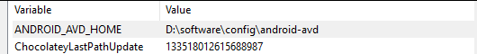

# Software List Only

## Partitions:

- /data -> /code, /software

- /archive -> /google-drive

**EOS Mirror Locations**

india, china, taiwan, thailand, us, worldwide

**No Install Apps**

- GithubDesktop - flatpak / aur
- android studio, vscode, redshift, joplin, postman, intellij, freetube, beekeeper, thunderbird (tar-sh, appimage)

## Always Install (Pacman + yay (endeavour-os))

### Pacman Main (sudo pacman -Syu)

Personal

```sh
audacious calibre chromium firefox fish flatpak geoclue2 gimp gtk2 inkscape
kcharselect hunspell-en_gb libreoffice-fresh mpv noto-fonts noto-fonts-emoji
obs-studio  qbittorrent qpdf syncthing torbrowser-launcher
```

Dev Only

```sh
android-tools composer go intellij-idea-community-edition jdk21-openjdk
kotlin mariadb maven neovim nodejs-lts-iron npm php php-gd postgresql
python python-pip
```

### AUR Main (yay -Syu)

```sh
grive ttf-ms-fonts github-desktop-bin libxcrypt-compat
```

## Pacman Optional

```
bluez bluez-utils "gnome-disk-utility | partitionmananger" filelight
flameshot gpaste gnome-keyring  jdk-openjdk nodejs noto-fonts-cjk
nfs-utils noto-fonts-extra qutebrowser midori scrcpy signal-desktop
```
XFCE clipboard
`sudo pacman -S xfce4-clipman-plugin; xfce4-popup-clipman; xfce4-clipman-history`


### AUR Optional

```sh
otpclient albert github-desktop-bin
tk # built in python gui
```

Dev Only

```sh
mongodb-bin mongodb-compass mongodb-tools-bin mongosh-bin
```

### Flatpak

- TOTP Authenticator -> com.belmoussaoui.Authenticator
- GitHub Desktop -> io.github.shiftey.Desktop

## APT package manager

```sh
sudo apt update
sudo apt install android-tools-adb android-tools-fastboot audacious calibre
chromium firefox flameshot geoclue-2.0 (default-jdk) openjdk-17-jdk otpclient
hunspell-dictionary-en-gb hunspell-en-gb libreoffice mpv python3 nodejs npm
qbittorrent qpdf syncthing torbrowser-launcher

gnome-disk-utility | partitionmanager filelight gnome-keyring qutebrowser
```
* sudo apt install nvidia-driver
* sudo apt install linux-image-6.5
Not Found:
- grive download from github and build from source
- noto-fonts are 'fonts-noto'
- github-desktop use flatpak
gtk2 noto-fonts
github-desktop grive ms-fonts albert*

### Ubuntu fonts audio codecs
apt install ubuntu-restricted-extras


## Flatpak
```
flatpak remote-add --if-not-exists flathub https://flathub.org/repo/flathub.flatpakrepo
flatpak search shiftkey
flatpak install io.github.shiftey.Desktop
```
Authenticator may not have access to filesystem
`sudo flatpak override com.belmoussaoui.Authenticator --filesystem=host`
## Install Gnome DE From Arch CLI

```sh
sudo pacman -S gnome-shell gnome-terminal gdm (lightdm) xorg-xwayland xorg-xlsclients

sudo systemctl enable gdm

sudo pacman -S gnome-calculator gnome-control-center gnome-disk-utility gnome-keyring gnome-menus gnome-tweaks mutter gnome-shell-extensions

yay -S gnome-browser-connector
pacman -S  xdg-desktop-portal
```

Extensions:
ArcMenu, Clipboard Indicator, CHC-E Hot corner, Dash to Panel, No overview at startup

## Install XFCE from Fedora dnf

dnf config

```sh
sudo vi /etc/dnf/dnf.conf
	max_parallel_downloads=20
	defaultyes=True
	fastestmirror=True
	keepcache=True

sudo hostnamectl set-hostname manan-pc
```

```sh
sudo dnf update
sudo dnf install xorg-x11-server-Xorg xorg-x11-xinit network-manager-applet xorg-x11-drv-libinput mesa-dri-drivers xfce4-panel xfce4-datetime-plugin xfce4-session xfce4-settings xfce4-terminal xfconf xfdesktop xfce4-appfinder xfce4-power-manager xfce4-pulseaudio-plugin pulseaudio gvfs lightdm-gtk xfwm4 NetworkManager-wifi

systemctlset-default graphical.target
systemctl enable lightdm
```

## DNF Package manager

```sh
dnf android-tools audacious calibre chromium flameshot firefox geoclue2 grive2 java-17-openjdk hunspell-en-GB gtk2 libreoffice mpv nodejs nodejs-npm qpdf syncthing torbrowser-launcher

gnome-keyring

gnome-disk-utility | kde-partitionmanager
```

Not found compared to pacman:
noto-fonts ttf-ms-fonts otpclient albert

# Windows
helix editor shortcut
```bat
start "" ""D:\software\installed\helix\hx.exe"" "D:\code\Code-Snippets"
```
## Mongo db do not install as service windows 
`mongod --port 27017 --dbpath C:\MongoDB\data\db`

## AVD Home if path changed for flutter or react native
